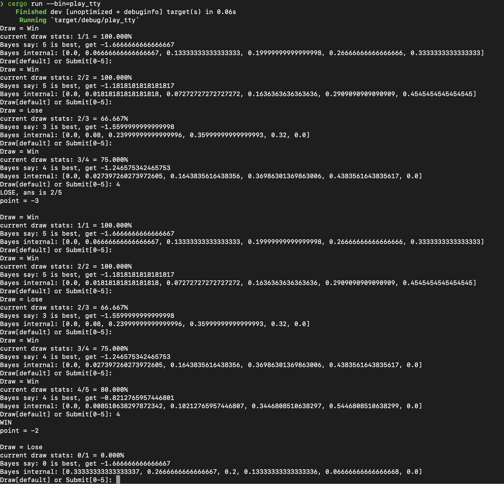

# くじ引きゲームでベイズ体験

元ネタ:

* https://twitter.com/Ototo_/status/1631196085757829120
* http://www.sci.hyogo-u.ac.jp/hammer/etc/fortune/fortune_Trial.html

## ターミナルで遊ぶ

```
cargo run --bin=play_tty
```



## p=(0/5, 1/5, 2/5, 3/5, 4/5, 5/5) が来る確率が常に一様

順次くじを引いて、ベイズを更新して「今 submit すると得られるポイントの期待値は？」を計算する。
その期待値が指定した閾値(0.0~0.9)を上回ったら実際に submit する戦略。

```
❯ for i in 0 1 2 3 4 5 6 7 8 9; do echo -n "0.$i => "; ./target/release/stats 0.$i > $i.txt; done
0.0 => avg: 0.691949
0.1 => avg: 3.517981
0.2 => avg: 3.972739
0.3 => avg: 5.294544
0.4 => avg: 6.257092
0.5 => avg: 6.790426
0.6 => avg: 7.029409
0.7 => avg: 7.022176
0.8 => avg: 6.824036
0.9 => avg: 6.231227
```


